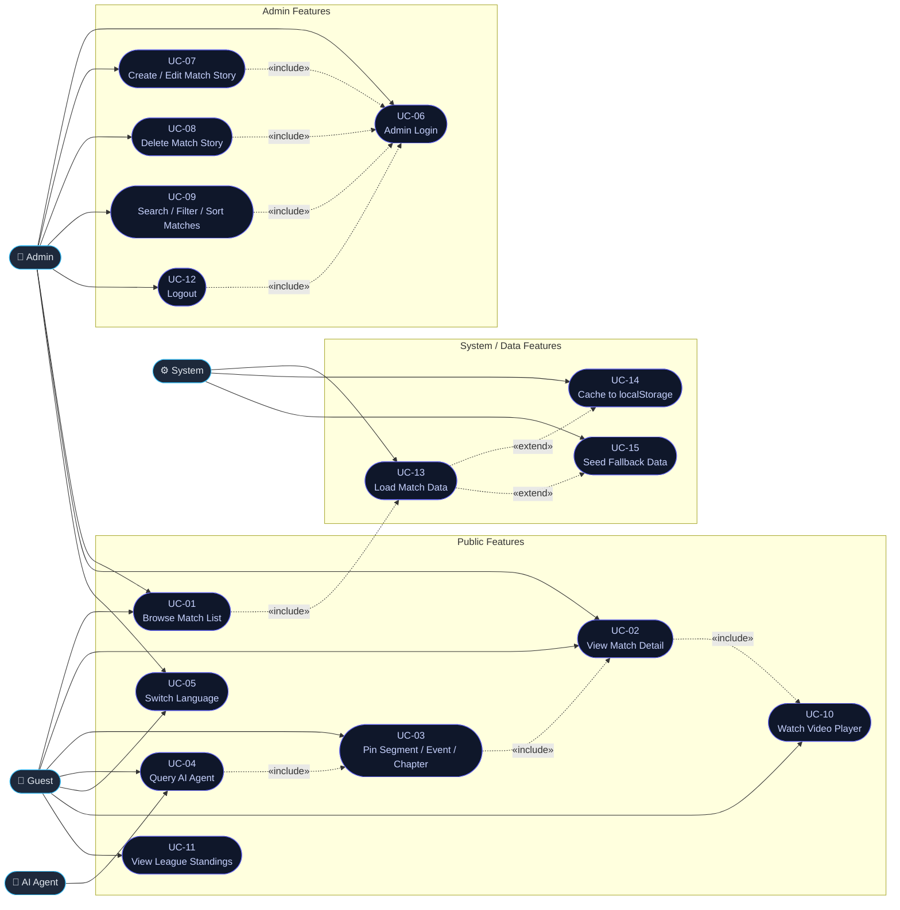
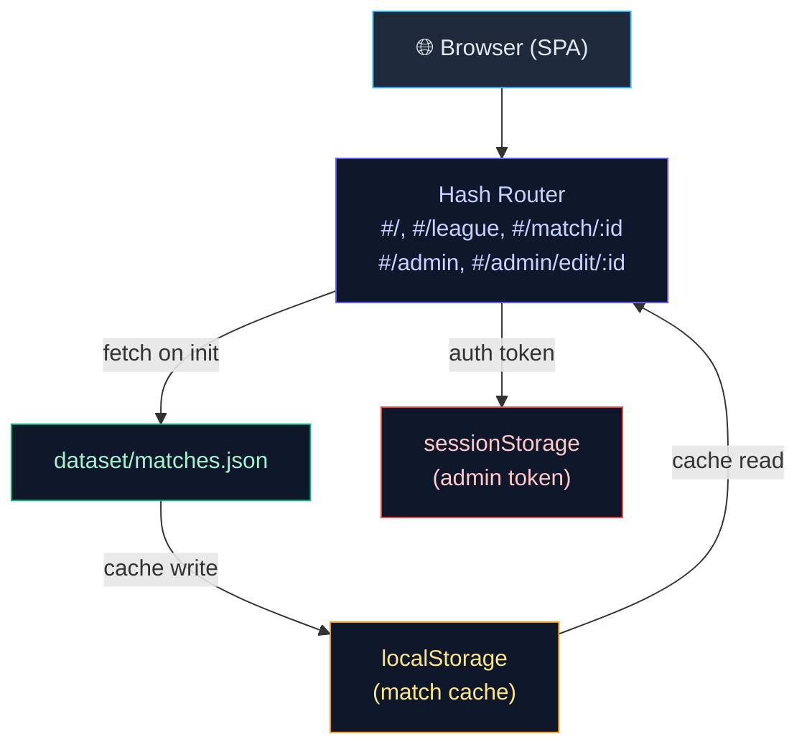

# Use Case Diagram / Biểu Đồ Use Case — MatchPulse

> [!NOTE]
> Mermaid does not natively support UML use-case diagrams, so a `flowchart LR` layout is used to approximate the standard notation: actors appear on the left/right edges, and use-cases appear as rounded rectangles in the centre.

---

## Full System Use Case Diagram

---

## Actor–Use Case Matrix

| Use Case | Guest | Admin | AI Agent | System |
|----------|:-----:|:-----:|:--------:|:------:|
| UC-01 Browse Match List | ✅ | ✅ | — | — |
| UC-02 View Match Detail | ✅ | ✅ | — | — |
| UC-03 Pin Segment / Event / Chapter | ✅ | ✅ | — | — |
| UC-04 Query AI Agent | ✅ | ✅ | ✅ | — |
| UC-05 Switch Language | ✅ | ✅ | — | — |
| UC-06 Admin Login | — | ✅ | — | — |
| UC-07 Create / Edit Match Story | — | ✅ | — | — |
| UC-08 Delete Match Story | — | ✅ | — | — |
| UC-09 Search / Filter Matches | — | ✅ | — | — |
| UC-10 Watch Video Player | ✅ | ✅ | — | — |
| UC-11 View League Standings | ✅ | ✅ | — | — |
| UC-12 Logout | — | ✅ | — | — |
| UC-13 Load Match Data | — | — | — | ✅ |
| UC-14 Cache to localStorage | — | — | — | ✅ |
| UC-15 Seed Fallback Data | — | — | — | ✅ |

---

## Relationship Legend

| Symbol | Meaning |
|--------|---------|
| `──────►` | **Association** — actor initiates use case |
| `- «include» →` | **Include** — base use case always invokes the included one |
| `- «extend» →` | **Extend** — optional or conditional behaviour |

---

## System Architecture Context

---

*Document version: 1.1 — 2026-05-24*
