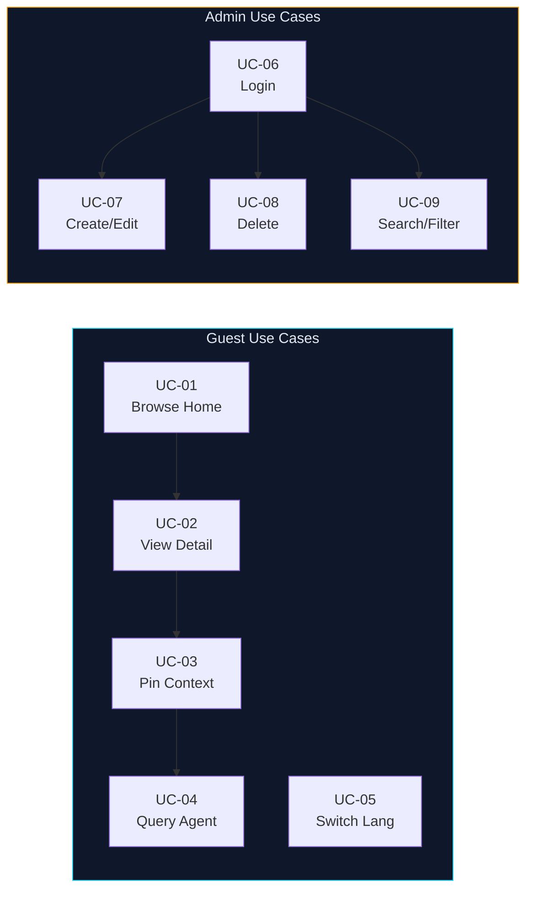

# Use Case Specification / Đặc Tả Use Case — MatchPulse

> [!IMPORTANT]
> This document covers **9 primary use cases** derived from the MatchPulse SPA codebase.
> Each specification follows the standard structured template: ID, Name, Actor, Precondition, Main Flow, Alternative Flow, Postcondition.

---

## Table of Contents / Mục Lục

| ID | Use Case Name | Primary Actor |
|----|--------------|---------------|
| [UC-01](#uc-01-browse-match-list--home) | Browse Match List (Home) | Guest |
| [UC-02](#uc-02-view-match-detail) | View Match Detail | Guest |
| [UC-03](#uc-03-pin-segment--event--chapter-as-chat-context) | Pin Segment / Event / Chapter as Chat Context | Guest |
| [UC-04](#uc-04-query-ai-agent) | Query AI Agent | Guest |
| [UC-05](#uc-05-switch-language) | Switch Language | Guest |
| [UC-06](#uc-06-admin-login) | Admin Login | Admin |
| [UC-07](#uc-07-createedit-match-story) | Create / Edit Match Story | Admin |
| [UC-08](#uc-08-delete-match-story) | Delete Match Story | Admin |
| [UC-09](#uc-09-searchfiltersort-matches-admin) | Search / Filter / Sort Matches (Admin) | Admin |

---

## UC-01: Browse Match List / Duyệt Danh Sách Trận Đấu (Home)

| Field | Detail |
|-------|--------|
| **Use Case ID** | UC-01 |
| **Name** | Browse Match List (Home) |
| **Actor** | Guest (primary), Admin (secondary) |
| **Trigger** | User navigates to `#/` (root route) |
| **Precondition** | Browser has loaded the SPA. `dataset/matches.json` is accessible, or localStorage cache exists, or seed fallback data is available. |
| **Postcondition** | User sees the match grid, hero card, Hot Reads rail, and Agent Brief rail rendered on the home page. |

### Main Flow

1. User opens the application URL or navigates to `#/`.
2. The hash router detects the `#/` route and calls `renderHome()`.
3. The system checks localStorage for a cached match list.
   - If a valid cache exists → uses cached data.
   - Otherwise → fetches `dataset/matches.json` from the server.
   - If fetch fails → uses `seedMatches` fallback data.
4. `renderHome()` selects the most recent or featured match and renders the **Hero Card** at the top of the page.
5. The system renders the first **7 matches** in the match grid below the hero card.
6. The **Hot Reads** rail on the right is populated with top-trending match articles.
7. The **Agent Brief** rail on the right is populated with a short AI-generated summary.
8. The user scrolls down and clicks **"Load More"**.
9. The system appends the next batch of matches to the grid.
10. The user clicks on a match card.
11. The router navigates to `#/match/:id` (triggers UC-02).

### Alternative Flows

| Alt ID | Condition | Steps |
|--------|-----------|-------|
| A1 | Network unavailable, no cache | Step 3: system uses `seedMatches` fallback; a warning banner may appear notifying limited data. |
| A2 | No more matches to load | Step 9: "Load More" button is hidden or disabled. |
| A3 | User navigates to `#/league` instead | Router calls `renderLeagues()` instead. |

> [!NOTE]
> The **initial render cap of 7 matches** is a deliberate UX choice to improve perceived page load speed. Subsequent batches are loaded lazily on user demand.

---

## UC-02: View Match Detail / Xem Chi Tiết Trận Đấu

| Field | Detail |
|-------|--------|
| **Use Case ID** | UC-02 |
| **Name** | View Match Detail |
| **Actor** | Guest (primary), Admin (secondary) |
| **Trigger** | User clicks a match card or navigates directly to `#/match/:id` |
| **Precondition** | The match with the given `:id` exists in the loaded match data. |
| **Postcondition** | Full article page is displayed with video player, timeline, chapter list, event timeline, stat table, and AI chat panel. |

### Main Flow

1. The hash router parses `#/match/:id` and extracts the match ID.
2. The system looks up the match object in the in-memory array (loaded in UC-01).
3. `renderDetail(match)` is called.
4. The system renders:
   - **Article header** (teams, score, date, competition badge)
   - **Video player** embedded at the top of the content area
   - **90-minute timeline bar** with clickable minute markers overlaid on the progress bar
   - **Chapter list** — named segments of the match video
   - **Event timeline** — chronological list of match events (goals, cards, substitutions)
   - **Stat table** — side-by-side team statistics
   - **AI Chat panel** on the right sidebar
5. User clicks a **timeline marker** → video seeks to that exact minute (step 6).
6. Video player updates its current playback position.
7. User reads the article, watches video, and interacts with the chat panel.

### Alternative Flows

| Alt ID | Condition | Steps |
|--------|-----------|-------|
| A1 | Match ID not found | System renders a 404 / "Match Not Found" message and offers a link back to `#/`. |
| A2 | Admin user visits the page | An "Edit" button is visible in the header, linking to `#/admin/edit/:id`. |
| A3 | User drags across timeline markers | A **Segment Action Bar** appears with start–end time range (triggers UC-03). |

> [!TIP]
> The timeline bar is a key interactive feature: clicking any minute marker not only seeks the video but also optionally highlights nearby events in the event timeline.

---

## UC-03: Pin Segment / Event / Chapter as Chat Context / Ghim Ngữ Cảnh Chat

| Field | Detail |
|-------|--------|
| **Use Case ID** | UC-03 |
| **Name** | Pin Segment / Event / Chapter as Chat Context |
| **Actor** | Guest (primary), Admin (secondary) |
| **Trigger** | User performs one of: drag-select timeline markers, click chapter pin button, click event pin button, or click "Pin Moment" |
| **Precondition** | UC-02 has been completed; the match detail page is active. |
| **Postcondition** | A context pill appears in the chat input bar referencing the pinned item. Subsequent AI queries are contextually aware of this pin. |

### Pinning Methods

| Method | User Action | Result |
|--------|------------|--------|
| **Segment Pin** | Drag across minute markers on timeline | Segment Action Bar appears with start–end range; user clicks **Attach** |
| **Chapter Pin** | Click the 📌 pin icon next to a chapter | Chapter pill added to chat context bar |
| **Event Pin** | Click the 📌 pin icon next to a match event | Event pill added; event row highlights in the timeline |
| **Moment Pin** | Click **"Pin Moment"** button in video area | Current video timestamp pinned as a context pill |

### Main Flow (Segment Drag Example)

1. User is on the match detail page (UC-02 completed).
2. User clicks and drags across two or more minute markers on the 90-minute timeline bar.
3. The system detects the drag gesture and records the start and end minute.
4. The **Segment Action Bar** appears below/above the timeline showing: `From: MM:00 → To: MM:00`.
5. User clicks **"Attach"**.
6. The system creates a context pill (e.g., `⏱ 35:00–52:00`) and inserts it into the chat input bar.
7. User clicks **"Cancel"** instead → Segment Action Bar dismisses without pinning.

### Alternative Flows

| Alt ID | Condition | Steps |
|--------|-----------|-------|
| A1 | User pins a chapter | Click chapter pin icon → chapter pill added to chat bar immediately (no confirmation step). |
| A2 | User pins an event | Click event pin icon → event pill added; row highlighted in event timeline. |
| A3 | Multiple pins active | Each new pin appends a new pill; all pills are visible in the chat bar. User can remove individual pills by clicking ✕. |
| A4 | User cancels segment drag | Clicks "Cancel" on Segment Action Bar → no pin created. |

> [!NOTE]
> The AI Agent (UC-04) reads all active context pills when generating a response. Removing a pill before sending reduces the context scope.

---

## UC-04: Query AI Agent / Truy Vấn AI Agent

| Field | Detail |
|-------|--------|
| **Use Case ID** | UC-04 |
| **Name** | Query AI Agent |
| **Actor** | Guest (initiator), AI Agent (responder) |
| **Trigger** | User types a message in the chat panel and presses Enter or the Send button, or clicks a quick-prompt button |
| **Precondition** | User is on the match detail page (`#/match/:id`). The chat panel is visible. |
| **Postcondition** | The AI Agent produces a contextual response displayed in the chat thread. |

### Main Flow

1. User views the match detail page with the AI Chat panel open.
2. *(Optional)* User pins one or more context items via UC-03 (segment, chapter, event, or moment).
3. User types a natural-language question in the chat input field (e.g., "Why was the red card given?").
4. User presses **Enter** or clicks the **Send** button.
5. The system collects:
   - The user's message text
   - All active context pills (pinned segments, events, chapters)
   - Nearby match events relative to the current video timestamp
6. The system passes this payload to the mock AI Agent function.
7. The AI Agent generates a contextual response referencing the pinned items and match data.
8. The response is appended to the chat thread as an agent message bubble.
9. The chat panel scrolls to the latest message.

### Alternative Flows

| Alt ID | Condition | Steps |
|--------|-----------|-------|
| A1 | User clicks a quick-prompt button | Step 3 is skipped; the prompt text is pre-filled in the input. Steps 4–9 proceed normally. |
| A2 | No context pins active | Agent responds using general match context (teams, score, key events). |
| A3 | Chat input is empty | Send button does nothing / is disabled until text is entered. |
| A4 | Agent API errors (future) | Display an error message in the chat thread: "Agent is unavailable. Please try again." |

> [!TIP]
> Quick-prompt buttons (e.g., "Explain this goal", "What happened here?") are designed to lower the barrier to AI engagement for users unfamiliar with open-ended queries.

---

## UC-05: Switch Language / Chuyển Đổi Ngôn Ngữ

| Field | Detail |
|-------|--------|
| **Use Case ID** | UC-05 |
| **Name** | Switch Language |
| **Actor** | Guest (primary), Admin (secondary) |
| **Trigger** | User clicks the **VI** or **EN** language toggle button in the navigation bar |
| **Precondition** | The SPA is loaded. Language toggle buttons are visible in the nav. |
| **Postcondition** | All UI text and match data fields are rendered in the selected language. The language preference persists for the session. |

### Main Flow

1. User identifies the language toggle in the top navigation bar (`VI` / `EN`).
2. User clicks **VI** to switch to Vietnamese, or **EN** to switch to English.
3. The system updates the global language state variable.
4. The current page re-renders using the new language:
   - All static UI labels, button text, and navigation items are translated.
   - Match data fields that have bilingual content (titles, summaries, event descriptions) are swapped to the selected language.
5. The active language button appears visually highlighted/selected.

### Alternative Flows

| Alt ID | Condition | Steps |
|--------|-----------|-------|
| A1 | User is already on the selected language | Click is a no-op; no re-render occurs. |
| A2 | Some match data has no translation for the selected language | Falls back to the available language for that field; no UI error. |

> [!NOTE]
> Language state is held in a JavaScript variable and does not currently persist across full page reloads (browser refresh). This is a known limitation.

---

## UC-06: Admin Login / Đăng Nhập Admin

| Field | Detail |
|-------|--------|
| **Use Case ID** | UC-06 |
| **Name** | Admin Login |
| **Actor** | Admin |
| **Trigger** | User navigates to `#/admin` while not authenticated |
| **Precondition** | No valid admin token in `sessionStorage`. The user has the admin password (`admin123`). |
| **Postcondition** | A valid token is stored in `sessionStorage`. The admin dashboard (`renderAdmin()`) is rendered. |

### Main Flow

1. User navigates to `#/admin`.
2. The router calls `renderAdmin()`, which checks `sessionStorage` for an auth token.
3. No token found → the system renders a **login modal / prompt**.
4. User enters the password in the password field.
5. User clicks **"Login"** or presses Enter.
6. The system compares the entered password against the hardcoded value `admin123`.
7. Password matches → system writes an auth token to `sessionStorage`.
8. Login modal closes; `renderAdmin()` proceeds to render the full admin dashboard.

### Alternative Flows

| Alt ID | Condition | Steps |
|--------|-----------|-------|
| A1 | Incorrect password | Step 7: system displays an error message "Incorrect password." Input field is cleared. Steps 4–6 repeat. |
| A2 | Token already in sessionStorage | Steps 3–7 are skipped; dashboard renders immediately. |
| A3 | User closes the login modal | The system routes the user back to `#/` (home). |

> [!CAUTION]
> The current authentication mechanism stores a plaintext password in JavaScript source code. **This is suitable for prototype/demo purposes only** and must be replaced with a proper backend authentication system before any production deployment.

---

## UC-07: Create / Edit Match Story / Tạo / Chỉnh Sửa Bài Viết Trận Đấu

| Field | Detail |
|-------|--------|
| **Use Case ID** | UC-07 |
| **Name** | Create / Edit Match Story |
| **Actor** | Admin |
| **Trigger** | Admin clicks **"Create Draft"** on the dashboard, or clicks **"Edit"** on an existing match |
| **Precondition** | Admin is authenticated (UC-06 completed). Admin token is valid in `sessionStorage`. |
| **Postcondition** | Match data is updated/created in the in-memory array and saved to `localStorage`. The inline editor reflects the saved state. |

### Main Flow — Create Draft

1. Admin is on the `#/admin` dashboard.
2. Admin clicks **"Create Draft"**.
3. System creates a new empty match object with a generated ID and default field values.
4. System appends the new match to the matches array and saves to `localStorage`.
5. System navigates to `#/admin/edit/<new-id>`, calling `renderInlineEditor(newMatch)`.
6. Proceeds to **Edit Flow** (step 3 below).

### Main Flow — Edit Existing Match

1. Admin is on the `#/admin` dashboard or match detail page.
2. Admin clicks **"Edit"** on an existing match.
3. System navigates to `#/admin/edit/:id`, calling `renderInlineEditor(match)`.
4. The page renders identically to the public detail view, but all editable fields are marked `contenteditable="true"`.
5. Admin clicks on any field (title, summary, team names, score, event descriptions, etc.) and types to edit.
6. Changes are reflected in real-time (live preview).
7. Admin clicks **"Save"**.
8. System reads all `contenteditable` field values from the DOM.
9. System updates the match object in the in-memory array.
10. System serializes the full matches array and saves it to `localStorage`.
11. System displays a success toast/notification.
12. *(Optional)* Admin clicks **"Publish"** to change the match status from `draft` to `published`.

### Alternative Flows

| Alt ID | Condition | Steps |
|--------|-----------|-------|
| A1 | Admin navigates away without saving | Changes in the DOM are lost; the match object retains its previous values. A confirm dialog may warn the admin. |
| A2 | Required fields left empty | Step 8: system validates and highlights empty required fields; does not save. |
| A3 | Admin saves as draft | Status field remains `draft`; match is not shown on the public home page. |

> [!IMPORTANT]
> All persistence is client-side (localStorage). Data will be lost if the user clears browser storage. A backend API integration is required for production.

---

## UC-08: Delete Match Story / Xóa Bài Viết Trận Đấu

| Field | Detail |
|-------|--------|
| **Use Case ID** | UC-08 |
| **Name** | Delete Match Story |
| **Actor** | Admin |
| **Trigger** | Admin clicks the **"Delete"** button on a match entry in the admin dashboard |
| **Precondition** | Admin is authenticated (UC-06 completed). The target match exists in the match array. |
| **Postcondition** | The match is removed from the in-memory array and from `localStorage`. It no longer appears in any view. |

### Main Flow

1. Admin is on the `#/admin` dashboard.
2. Admin locates the target match in the match list.
3. Admin clicks the **"Delete"** (🗑) button on the match entry.
4. System displays a **confirmation dialog**: "Are you sure you want to delete this match? This action cannot be undone."
5. Admin clicks **"Confirm"** / **"Yes"**.
6. System finds the match by ID in the in-memory array and removes it using `Array.splice()` or `Array.filter()`.
7. System serializes the updated matches array and saves it to `localStorage`.
8. The match entry disappears from the admin dashboard list.
9. System displays a success toast: "Match deleted successfully."

### Alternative Flows

| Alt ID | Condition | Steps |
|--------|-----------|-------|
| A1 | Admin clicks "Cancel" in the confirmation dialog | No deletion occurs; the match remains in the list. |
| A2 | Match ID not found in array | System logs a warning; UI shows an error notification. Array state is unchanged. |
| A3 | localStorage write fails | System notifies admin of the write failure; in-memory state reflects deletion but persistence may be inconsistent. |

> [!WARNING]
> Deletion is **permanent and irreversible** within the current client-side architecture. There is no undo, recycle bin, or soft-delete mechanism. Admins should exercise caution.

---

## UC-09: Search / Filter / Sort Matches (Admin) / Tìm Kiếm / Lọc / Sắp Xếp (Admin)

| Field | Detail |
|-------|--------|
| **Use Case ID** | UC-09 |
| **Name** | Search / Filter / Sort / Group Matches (Admin) |
| **Actor** | Admin |
| **Trigger** | Admin types in the search box, or changes a filter/sort/group dropdown on the admin dashboard |
| **Precondition** | Admin is authenticated (UC-06 completed). Matches are loaded and displayed in the admin dashboard. |
| **Postcondition** | The match list is filtered/sorted/grouped according to the admin's criteria. State variables are updated. |

### Available Controls

| Control | Type | Behavior |
|---------|------|----------|
| **Search** | Text input | Filters matches by title, team name, or competition (case-insensitive substring match) |
| **Status Filter** | Dropdown | Filters by `all`, `published`, or `draft` |
| **Competition Filter** | Dropdown | Filters by competition/league name |
| **Sort Order** | Dropdown | Sorts by date (newest/oldest), title (A–Z / Z–A), or score |
| **Group By** | Dropdown | Groups match list by competition, date, or status |

### Main Flow

1. Admin is on the `#/admin` dashboard with the full match list displayed.
2. Admin types a query string into the **Search** input field.
3. The system applies a real-time client-side filter:
   - The full match array is filtered by checking if the query substring matches `title`, `home`, `away`, or `league` fields.
4. The match list re-renders instantly with only matching entries.
5. Admin selects a **Status** from the status filter dropdown (e.g., "Published").
6. The system applies the status filter on top of the existing search filter.
7. Admin selects a **Sort** option (e.g., "Newest First").
8. The system sorts the filtered array by the selected field.
9. Admin selects a **Group By** option (e.g., "By Competition").
10. The system groups the sorted, filtered array and renders group headers in the list.
11. Admin clears the search field and resets dropdowns → full unfiltered list is restored.

### Alternative Flows

| Alt ID | Condition | Steps |
|--------|-----------|-------|
| A1 | No matches match the search/filter | The list renders empty with a "No matches found" placeholder message. |
| A2 | Admin resets all filters | All state variables are cleared to defaults; the full match list renders. |
| A3 | Group By is "None" | Match list is rendered as a flat, ungrouped list. |

> [!NOTE]
> All filtering, sorting, and grouping are performed entirely **client-side** using JavaScript array methods. No server requests are made during this use case. Performance may degrade with very large datasets.

---

## Summary / Tổng Kết

| Use Case | Complexity | Status |
|----------|-----------|--------|
| UC-01 Browse Match List | Low | ✅ Implemented |
| UC-02 View Match Detail | High | ✅ Implemented |
| UC-03 Pin Segment / Event / Chapter | High | ✅ Implemented |
| UC-04 Query AI Agent | Medium | ✅ Implemented (mock) |
| UC-05 Switch Language | Medium | ✅ Implemented |
| UC-06 Admin Login | Low | ✅ Implemented |
| UC-07 Create / Edit Match Story | High | ✅ Implemented |
| UC-08 Delete Match Story | Low | ✅ Implemented |
| UC-09 Search / Filter / Sort | Medium | ✅ Implemented |

---

*Document version: 1.1 — 2026-05-24 | MatchPulse Football Blog SPA*
