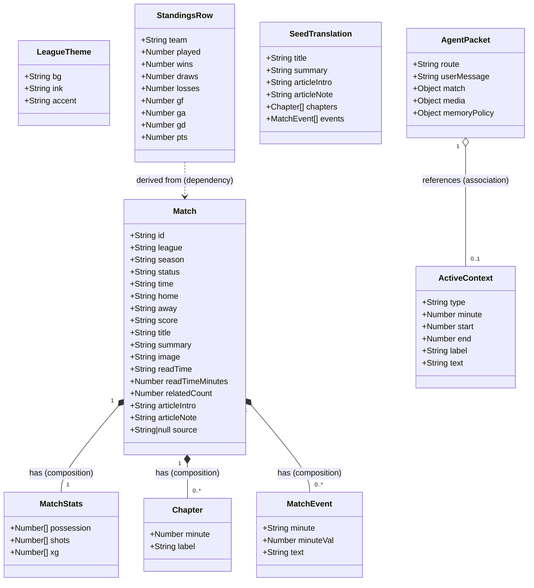

# 03 — Logical Type Shapes & Class Diagram

> **Note:** MatchPulse uses plain JavaScript objects (no ES6 classes). The diagram below documents the *logical shapes* of those objects as if they were classes, for architecture reference purposes.

---

## Class Diagram



---

## Field Reference

### `Match` — Core Domain Object

| Field | Type | Description |
|---|---|---|
| `id` | `string` | URL-safe slug, unique identifier. e.g. `"man-city-arsenal"` |
| `league` | `string` | e.g. `"Premier League"`, `"Ligue 1"` |
| `season` | `string` | e.g. `"2023-2024"` *(optional, from dataset)* |
| `status` | `string` | **ENUM**: `"Final"` \| `"Preview"` \| `"Analysis"` \| `"Live brief"` \| `"Tactical room"` \| `"Draft"` |
| `time` | `string` | Format: `"HH:MM, DD/MM/YYYY"` or `"HH:MM, DayName"` |
| `home` | `string` | Home team name |
| `away` | `string` | Away team name |
| `score` | `string` | Format: `"N - N"` |
| `title` | `string` | Article headline |
| `summary` | `string` | Short dek text for cards |
| `image` | `string` | URL to cover image |
| `readTime` | `string` | Display string e.g. `"5 phút"` *(locale-sensitive, display only)* |
| `readTimeMinutes` | `number` | Numeric read time for sort/filter logic *(auto-derived by `normalizeMatch` if absent)* |
| `relatedCount` | `number` | Count of related articles *(renamed from `related` for clarity)* |
| `stats` | `MatchStats` | Nested stats object |
| `chapters` | `Chapter[]` | Array of tactical chapters |
| `events` | `MatchEvent[]` | Array of typed timeline event objects |
| `articleIntro` | `string` | Article introduction paragraph |
| `articleNote` | `string` | Closing editorial note |
| `source` | `string \| null` | Raw data path from dataset; `null` for seed matches |

---

### `MatchStats` — Nested Stats Object

| Field | Type | Description |
|---|---|---|
| `possession` | `[number, number]` | `[home%, away%]` |
| `shots` | `[number, number]` | `[home, away]` |
| `xg` | `[number, number]` | `[home xG, away xG]` |

---

### `Chapter` — Tactical Chapter

| Field | Type | Description |
|---|---|---|
| `minute` | `number` | Match minute (1–90) |
| `label` | `string` | e.g. `"Arsenal phản pressing"` |

---

### `MatchEvent` — Timeline Event Object

> **Typed object** — migrated from anonymous `[string, string]` tuple in schema normalization (2026-05-24).

| Field | Type | Description |
|---|---|---|
| `minute` | `string` | Minute display string, e.g. `"04'"` or `"66'"` |
| `minuteVal` | `number` | Parsed numeric minute for filtering/sorting, e.g. `4` or `66` |
| `text` | `string` | Event description text |

**Example:**
```js
{ minute: "04'", minuteVal: 4, text: "Australia push wingbacks high..." }
```

> `minuteVal` is computed by `parseMinuteVal(minuteStr)` — a shared helper that extracts the leading integer from strings like `"66+2'"`.

---

### `ActiveContext` — UI State for Chat Pinning

| Field | Type | Description |
|---|---|---|
| `type` | `"moment"` \| `"range"` \| `"chapter"` \| `"event"` | Context kind |
| `minute?` | `number` | For `moment` and `event` types (matches `MatchEvent.minuteVal`) |
| `start?` | `number` | For `range` type |
| `end?` | `number` | For `range` type |
| `label?` | `string` | For `chapter` type |
| `text?` | `string` | For `event` description (matches `MatchEvent.text`) |

---

### `LeagueTheme` — Visual Theming

| Field | Type | Description |
|---|---|---|
| `bg` | `string` | CSS color for background |
| `ink` | `string` | CSS color for text |
| `accent` | `string` | Hex or CSS variable for accent |

---

### `StandingsRow` — Computed at Runtime

| Field | Type | Description |
|---|---|---|
| `team` | `string` | Team name |
| `played` | `number` | Matches played |
| `wins` | `number` | Wins |
| `draws` | `number` | Draws |
| `losses` | `number` | Losses |
| `gf` | `number` | Goals for |
| `ga` | `number` | Goals against |
| `gd` | `number` | Goal difference |
| `pts` | `number` | Points |

---

### `SeedTranslation` — i18n Overlay

| Field | Type | Description |
|---|---|---|
| `title` | `string` | Translated article headline |
| `summary` | `string` | Translated dek text |
| `articleIntro?` | `string` | Translated intro *(optional)* |
| `articleNote?` | `string` | Translated closing note *(optional)* |
| `chapters?` | `Chapter[]` | Translated chapter labels *(optional)* |
| `events?` | `MatchEvent[]` | Translated event descriptions *(optional)* |

---

### `AgentPacket` — Sent to Mock Agent

| Field | Type | Description |
|---|---|---|
| `route` | `"match-detail"` | Fixed route identifier |
| `userMessage` | `string` | The user's chat input |
| `activeContext` | `ActiveContext \| null` | Current pinned context |
| `match` | `{ id, title, teams, score, stats }` | Minimal match snapshot |
| `media` | `{ currentMinute, nearbyEvents: MatchEvent[], retrievalWindowSeconds }` | Playhead state |
| `memoryPolicy` | `{ keepLastTurns, summarizeOlderTurns, retrieveBy }` | Chat memory config |

---

## Utility Functions

### `parseMinuteVal(minuteStr: string): number`

Extracts the leading integer from a minute display string. Used to populate `MatchEvent.minuteVal`.

```js
parseMinuteVal("04'")   // → 4
parseMinuteVal("66'")   // → 66
parseMinuteVal("90+2'") // → 90
parseMinuteVal("")      // → 0
```

### `normalizeMatch(match: object): Match`

Normalizes any raw match object into the canonical schema. Handles backward compatibility:

- Converts legacy `[string, string][]` event tuples → `MatchEvent[]` objects
- Maps `match.related` → `relatedCount` (if `relatedCount` absent)
- Derives `readTimeMinutes` from `readTime` string (if numeric field absent)
- Sets `source: match.source ?? null`

Always pass raw data through `normalizeMatch()` before using it in the UI.

---

## Schema Issues — Resolved ✅

The following inconsistencies were identified during architecture review (2026-05-24) and have been **fully resolved**:

| # | Issue | Status |
|---|---|---|
| 1 | `events` stored as `[string, string][]` tuple — fragile, not self-documenting | ✅ Migrated to `MatchEvent` typed objects with `minute`, `minuteVal`, `text` |
| 2 | `related` field poorly named — ambiguous semantics | ✅ Renamed to `relatedCount: number` with backward compat in `normalizeMatch()` |
| 3 | `readTime` mixed language strings (`"5 phút"` / `"3 min"`) — hard to sort/filter | ✅ Added `readTimeMinutes: number`; `normalizeMatch()` auto-derives it |
| 4 | `source` field missing from `seedMatches` — inconsistent presence | ✅ Explicitly `source: string \| null` across all matches |
| 5 | `shouldLoadEvents` accessed `match.events[0][1]` (tuple index) | ✅ Now uses `match.events[0]?.text` (named field) |

---

*Last updated: 2026-05-24 — Schema standardization pass*
