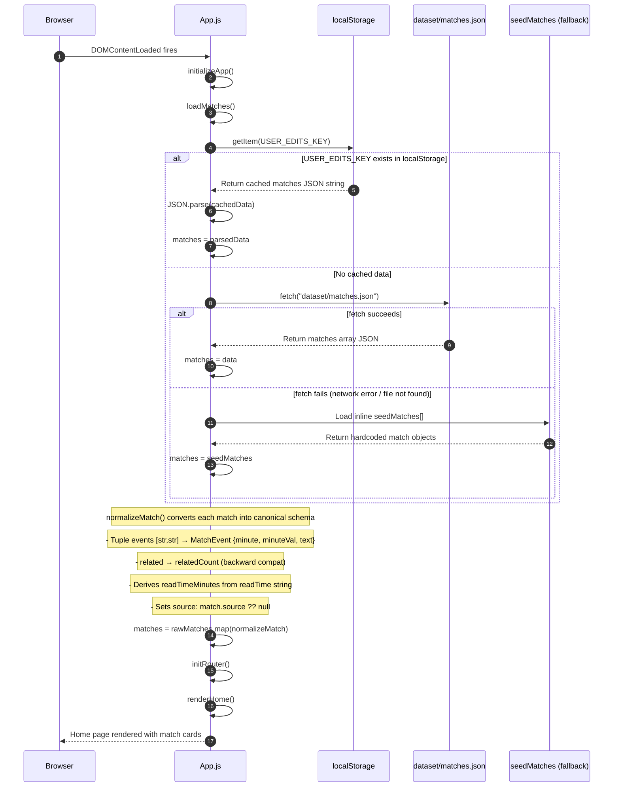
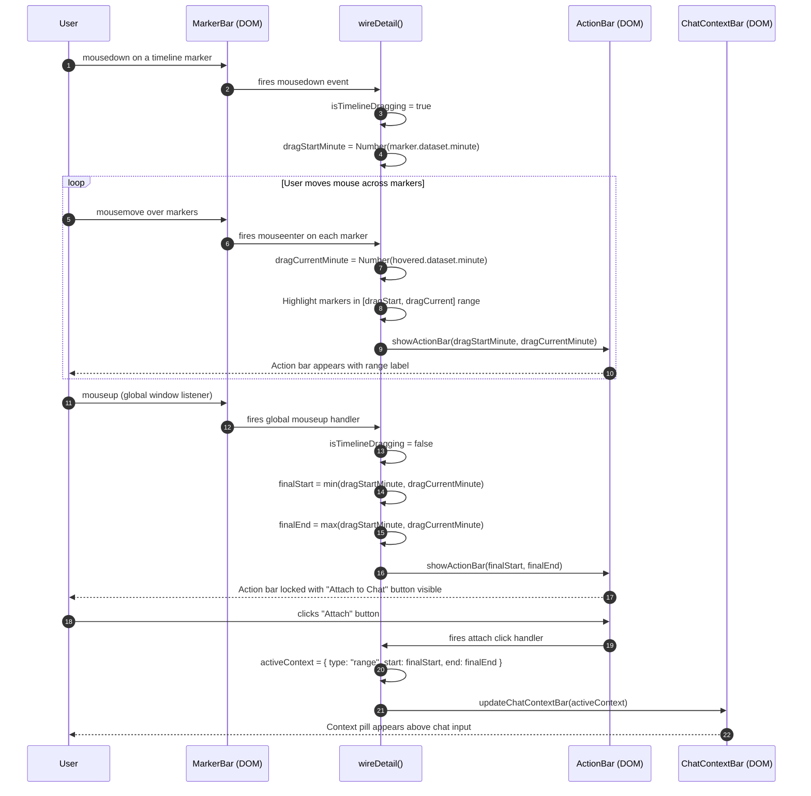
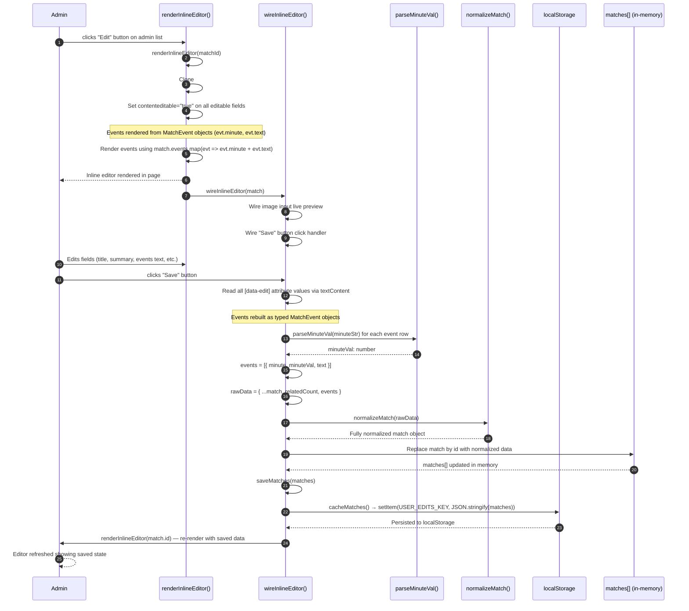

# 04 — Sequence Diagrams

> These diagrams document the four key interaction flows in MatchPulse. All flows are client-side only; there is no real backend — `askAgent()` is a mock with a simulated delay.

---

## SD-01: Page Load & Data Initialization



---

## SD-02: User Drags Timeline to Select Segment & Attaches to Chat



---

## SD-03: User Sends Chat Message with Active Context

```mermaid
sequenceDiagram
    autonumber
    participant User
    participant ChatForm as ChatForm (DOM)
    participant BuildCtx as buildAgentContext()
    participant AskAgent as askAgent()
    participant ChatLog as ChatLog (DOM)

    User->>ChatForm: Types message and submits
    ChatForm->>ChatLog: appendMessage("user", userText)
    ChatLog-->>User: User bubble appears immediately

    ChatForm->>BuildCtx: buildAgentContext(match, currentMinute, userText)

    BuildCtx->>BuildCtx: Inspect activeContext.type
    alt type === "moment"
        BuildCtx->>BuildCtx: contextInfo = { minute: activeContext.minute }
        BuildCtx->>BuildCtx: queryMinute = activeContext.minute
    else type === "range"
        BuildCtx->>BuildCtx: contextInfo = { start: activeContext.start, end: activeContext.end }
        BuildCtx->>BuildCtx: queryMinute = midpoint of range
    else type === "chapter"
        BuildCtx->>BuildCtx: contextInfo = { label: activeContext.label }
    else type === "event"
        BuildCtx->>BuildCtx: contextInfo = { minute: activeContext.minute, text: activeContext.text }
    else no activeContext
        BuildCtx->>BuildCtx: contextInfo = null (use video playback time)
    end

    Note over BuildCtx: Filter uses typed MatchEvent objects (not tuples)
    BuildCtx->>BuildCtx: nearbyEvents = match.events.filter(evt => evt.minuteVal within window)
    BuildCtx-->>AskAgent: Return AgentPacket { route, userMessage, activeContext, match, media{ nearbyEvents: MatchEvent[] } }

    AskAgent->>AskAgent: await delay(350ms)  [simulated network]
    AskAgent->>AskAgent: Generate contextIntro based on ctx.type and currentLanguage via t()
    Note over AskAgent: Format events: evt.minute + " " + evt.text (not tuple .join)
    AskAgent->>AskAgent: eventText = nearbyEvents.map(evt => evt.minute + " " + evt.text).join("; ")
    AskAgent->>AskAgent: Construct full response string

    AskAgent-->>ChatLog: appendMessage("agent", responseText)
    ChatLog-->>User: Agent bubble appears in chat log
```

---

## SD-04: Admin Edits & Saves Match Story



---

## Quick Reference — Actors Glossary

| Actor | Description |
|---|---|
| `Browser` | The browser environment; fires lifecycle events like `DOMContentLoaded` |
| `App.js` | Main application module; owns routing, data loading, and rendering |
| `localStorage` | Browser storage used to persist user edits via `USER_EDITS_KEY` |
| `dataset/matches.json` | External JSON file fetched at runtime containing full match records |
| `seedMatches` | Hardcoded inline fallback array in `app.js` used when fetch fails |
| `MarkerBar` | DOM element rendering per-minute timeline markers |
| `wireDetail()` | Function that attaches all event listeners to the detail page |
| `ActionBar` | Floating action overlay shown during/after timeline drag |
| `ChatContextBar` | DOM strip above the chat input showing the currently pinned context pill |
| `ChatForm` | The chat input form element |
| `buildAgentContext()` | Pure function assembling `AgentPacket` from current state; uses `evt.minuteVal` for filtering |
| `askAgent()` | Mock async function simulating an AI agent response (350ms delay) |
| `ChatLog` | Scrollable DOM container holding user and agent message bubbles |
| `parseMinuteVal()` | Utility: extracts numeric minute from display string like `"04'"` → `4` |
| `normalizeMatch()` | Converts raw match data to canonical schema with backward compat for tuples and `related` field |
| `renderInlineEditor()` | Function that clones the detail template and makes fields editable |
| `wireInlineEditor()` | Function that wires Save handler; rebuilds typed MatchEvent objects on save |
| `matches[]` | In-memory array of normalized match objects, the single source of truth at runtime |

---

*Last updated: 2026-05-24 — Schema standardization pass*
