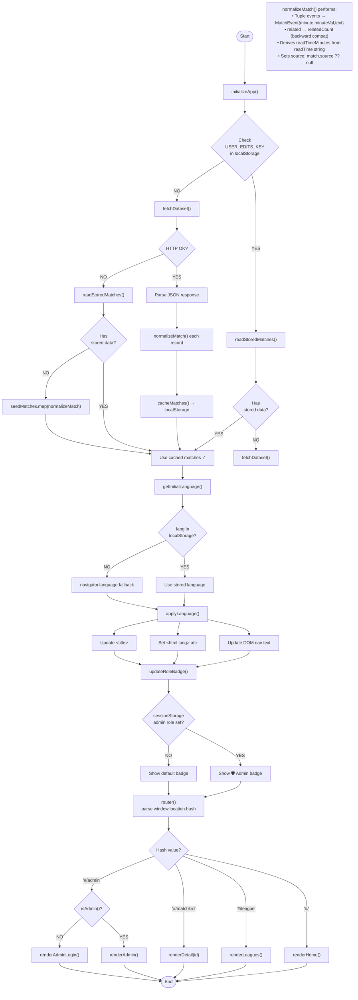
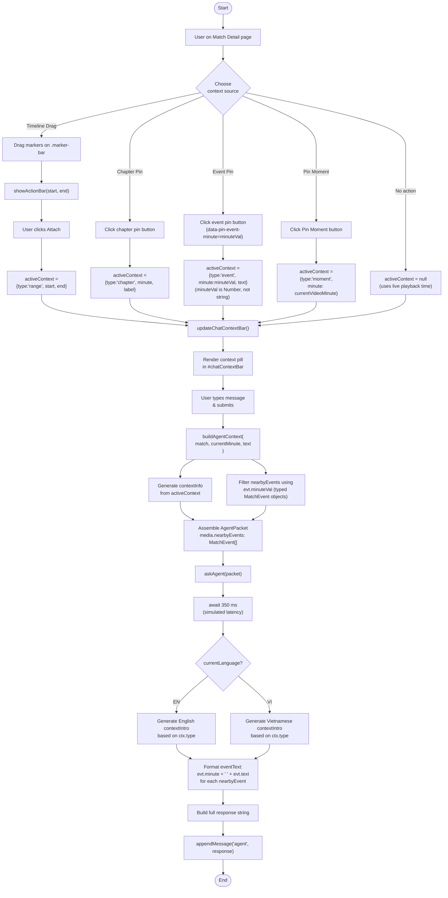
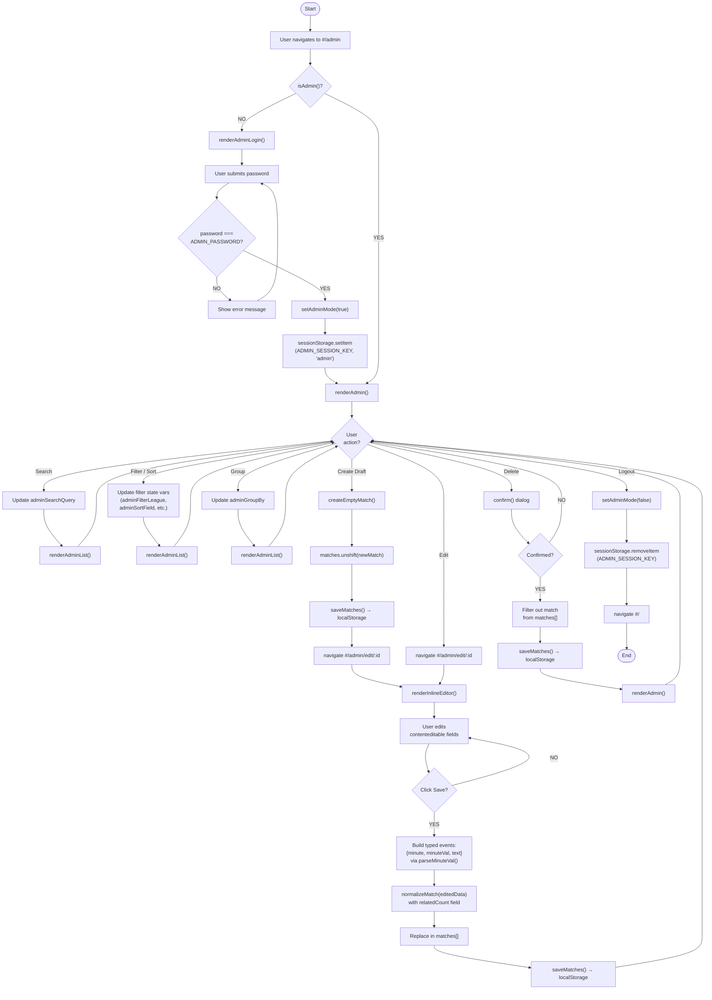

# 05 – Activity Diagrams

> **Document:** `05_activity_diagram.md`
> **Project:** MatchPulse Football SPA
> **Version:** 1.1
> **Last Updated:** 2026-05-24 (Schema standardization pass)

This document captures the runtime behaviour of MatchPulse through three UML-style activity diagrams rendered with Mermaid `flowchart TD` notation.

---

## AD-01 · App Startup & Data Loading

Describes the sequence of operations that run once when `index.html` is first loaded and `initializeApp()` is called from `app.js`.

---

## AD-02 · User Pins Context & Queries Agent

Describes what happens from the moment a user arrives on a Match Detail page to when the AI agent returns a response in the chat log.

---

## AD-03 · Admin Manages Match Stories

Describes the full admin lifecycle: authentication gate, list operations, inline editing, and logout.

---

## Diagram Legend

| Symbol | Meaning |
|--------|---------|
| `([…])` | Start / End terminal |
| `[…]` | Action / Process step |
| `{…}` | Decision / Guard condition |
| `-- label -->` | Transition with guard label |
| Indented subgraph | Logically grouped sub-flow |

> [!NOTE]
> All three flows share the same `matches[]` array held in application-layer memory. Persistence is handled exclusively through `saveMatches()` (localStorage) and read back via `readStoredMatches()` — there is no server-side database in the current architecture.

> [!NOTE]
> `normalizeMatch()` is backward-compatible: it converts legacy `[string, string][]` event tuples to typed `MatchEvent` objects, and maps the old `related` field to `relatedCount`. This ensures existing localStorage data remains readable after schema updates.

> [!TIP]
> The mock latency in **AD-02** (`await 350ms`) exists so the UX feels responsive during development. When a real AI API is integrated, this block will be replaced by an `await fetch(AI_ENDPOINT, …)` call.

*Last updated: 2026-05-24 — Schema standardization pass*
