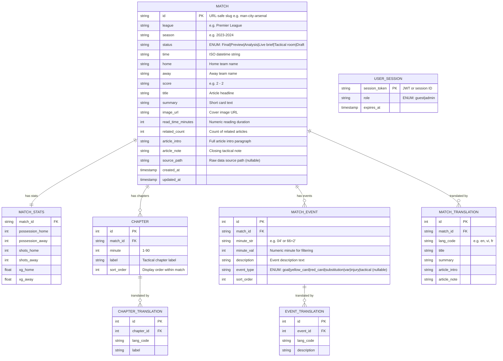

# 06 · ERD — Entity-Relationship Diagram

> **Context**: MatchPulse currently has **no relational database**. All data is stored in a flat JSON file (`dataset/matches.json`) and cached in `localStorage`. This document describes the **logical data model** as an ERD so the schema is ready for migration to a real database (PostgreSQL, Supabase, Firebase Firestore, etc.).

---

## Current Storage Reality

| Storage | Key | Content | Lifespan |
|---|---|---|---|
| `dataset/matches.json` | — | Master static dataset (~250+ records) | Deploy-time |
| `localStorage['matchpulse.matches']` | `STORAGE_KEY` | Serialized matches array (JSON) | Browser session |
| `localStorage['matchpulse.userEdits']` | `USER_EDITS_KEY` | `"1"` flag if user has edited data | Browser session |
| `sessionStorage['matchpulse.role']` | `ADMIN_SESSION_KEY` | `"admin"` token if logged in | Browser tab |

> [!WARNING]
> The current demo uses `admin123` as a hardcoded password with no hashing or real authentication. For production, this MUST be replaced with a proper auth backend (JWT, OAuth2, etc.).

---

## Logical ERD (Target Schema)



---

## Field-Level Specification

### MATCH

| Field | Type | Constraints | Notes |
|---|---|---|---|
| `id` | `VARCHAR(200)` | PK, UNIQUE, NOT NULL | URL-safe slug: `[a-z0-9-]+` |
| `league` | `VARCHAR(100)` | NOT NULL | Indexed for filtering |
| `season` | `VARCHAR(20)` | NULLABLE | e.g. `"2023-2024"` |
| `status` | `VARCHAR(30)` | NOT NULL, ENUM | See ENUM table below |
| `time` | `TIMESTAMPTZ` | NOT NULL | Normalized from string |
| `home` | `VARCHAR(100)` | NOT NULL | Original language name |
| `away` | `VARCHAR(100)` | NOT NULL | Original language name |
| `score` | `VARCHAR(10)` | NOT NULL | Format: `"N - N"` |
| `title` | `TEXT` | NOT NULL | Default language (vi) |
| `summary` | `TEXT` | NULLABLE | |
| `image_url` | `TEXT` | NULLABLE | Validated URL |
| `read_time_minutes` | `INT` | DEFAULT 3 | Replaces mixed-lang string |
| `related_count` | `INT` | DEFAULT 0 | Renamed from `related` |
| `article_intro` | `TEXT` | NULLABLE | |
| `article_note` | `TEXT` | NULLABLE | |
| `source_path` | `TEXT` | NULLABLE | Raw data origin |
| `created_at` | `TIMESTAMPTZ` | DEFAULT NOW() | |
| `updated_at` | `TIMESTAMPTZ` | DEFAULT NOW() | |

### Status ENUM

| Value | Vietnamese Label | English Label |
|---|---|---|
| `Final` | Kết thúc | Final |
| `Preview` | Xem trước | Preview |
| `Analysis` | Phân tích | Analysis |
| `Live brief` | Tóm tắt trực tiếp | Live brief |
| `Tactical room` | Phòng chiến thuật | Tactical room |
| `Draft` | Bản nháp | Draft |

### MATCH_EVENT — Event Type ENUM

| Value | Description |
|---|---|
| `goal` | Regular goal |
| `yellow_card` | Yellow card |
| `red_card` | Direct red card |
| `second_yellow` | Second yellow → red |
| `penalty` | Penalty kick |
| `own_goal` | Own goal |
| `substitution` | Player substitution |
| `var` | VAR review |
| `injury` | Player injury |
| `tactical` | Tactical observation (default for analytical events) |

---

## Client-Side Schema Standardization & DB Migration Plan

> [!NOTE]
> Several schema inconsistencies have been standardized in memory and in the client-side cache (`localStorage`) in **v1.1** via the `normalizeMatch()` pipeline. Below is the status of these fixes and what remains for a true relational database migration.

| Issue | Current State (v1.0 flat data) | Client-side SPA Status (v1.1) | Production Relational Fix |
|---|---|---|---|
| `time` format | Mixed: `"21:30, Chủ nhật"`, `"00:30, 13/08/2023"`, ISO strings | 🟡 Kept raw for display | Normalize to `TIMESTAMPTZ` at database ingest |
| `readTime` type | String: `"5 phút"` or `"3 min"` | ✅ Auto-derived `readTimeMinutes: number` in memory | Store as `INT read_time_minutes` |
| `events` structure | `[string, string][]` anonymous tuple | ✅ Converted to typed `MatchEvent` objects | Migrate to `MATCH_EVENT` table with foreign key and sorted order |
| `related` naming | Ambiguous `related: number` | ✅ Standardized to `relatedCount: number` | Store as `INT related_count` |
| i18n data | Hardcoded in `SEED_TRANSLATIONS` | 🟡 Kept in inline dictionaries | Migrate to `MATCH_TRANSLATION` tables |
| No `season` in seeds | seedMatches missing `season` field | ✅ Defaulted to `null` in `normalizeMatch()` | Column is `NULLABLE` in database |
| Chapter goals detection | Detects by string: `includes("bàn") \|\| includes("goal")` | 🟡 Kept string detection | Add `is_goal: boolean` field to `CHAPTER` table |

---

## localStorage Schema (Current)

```json
{
  "matchpulse.matches": "[{...Match JSON...}, ...]",
  "matchpulse.userEdits": "1",
  "matchpulse.lang": "vi"
}
```

```json
{
  "matchpulse.role": "admin"
}
```
_(stored in `sessionStorage`)_
