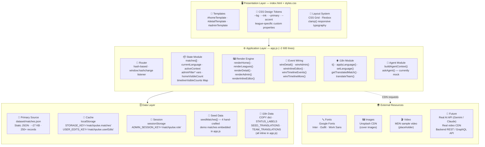
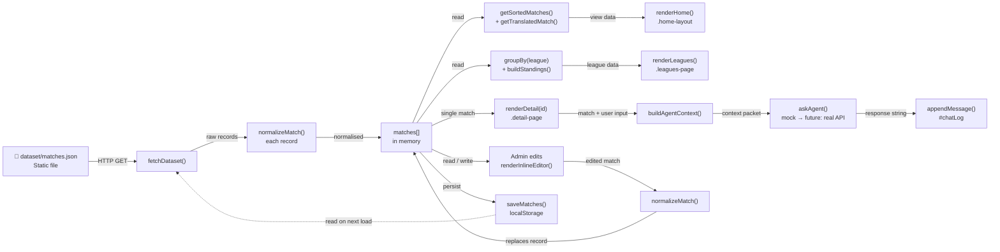
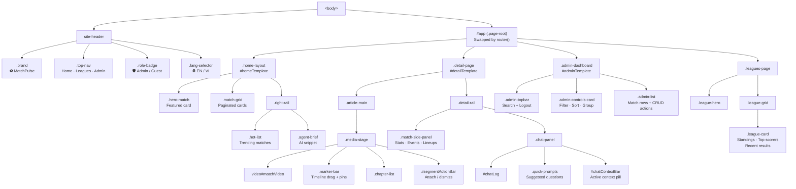
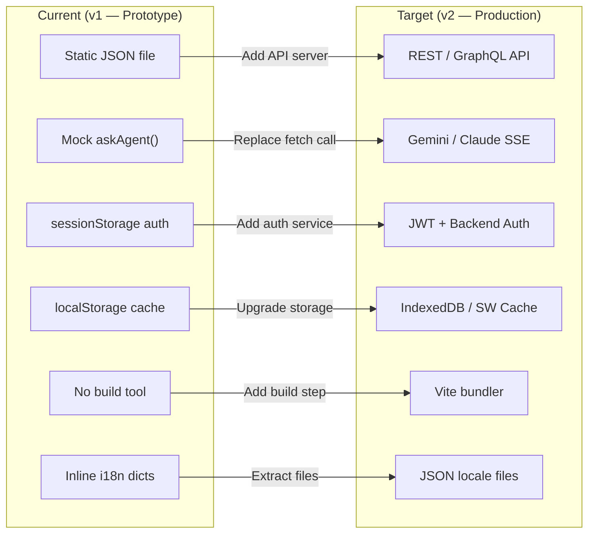

# 07 – Architecture Diagrams

> **Document:** `07_architecture_diagram.md`
> **Project:** MatchPulse Football SPA
> **Version:** 1.1
> **Last Updated:** 2026-05-24

This document provides a layered view of the MatchPulse architecture through four complementary diagrams, followed by an upgrade path analysis for moving to a production-grade system.

---

## 1 · Layer Architecture

A top-down breakdown of all three architectural layers and their constituent modules.

---

## 2 · Data Flow Diagram

Left-to-right view of how data moves through the system during typical user sessions.

---

## 3 · Component Map

Structural breakdown of the DOM component hierarchy rendered by the application.

---

## 4 · Module Dependency Matrix

| Consumer → | Router | State | Render Engine | Event Wiring | i18n | Agent | Data Layer |
|---|:---:|:---:|:---:|:---:|:---:|:---:|:---:|
| **Router** | — | R | W | — | — | — | — |
| **State** | — | — | — | — | R | — | RW |
| **Render Engine** | — | R | — | — | R | — | R |
| **Event Wiring** | W | RW | W | — | — | W | — |
| **i18n** | — | RW | — | — | — | — | R |
| **Agent** | — | R | — | — | R | — | R |

> R = reads · W = writes · RW = reads and writes

---

## 5 · Client-Side Schema Standardization (v1.1)

In v1.1, the application standardized its client-side memory and cache schemas to eliminate structural inconsistencies and align with relational database targets:

*   **`MatchEvent` Object Pattern**: Converted the legacy `[string, string][]` anonymous tuple array into a typed list of objects containing `minute` (string), `minuteVal` (number), and `text` (string).
*   **`relatedCount` Property**: Standardized the ambiguously named `related` field to `relatedCount`.
*   **`readTimeMinutes` Property**: Added `readTimeMinutes` derived dynamically from the localized display string `readTime` (e.g. `"5 phút"` or `"3 min"` → `5` or `3`) to support proper sorting.
*   **`source` Property**: Standardized the `source` field as `string | null` to represent raw files, defaulting to `null` for mock seeds.
*   **Robust Backward Compatibility**: Enhanced `normalizeMatch()` to automatically convert old schema records (e.g. from local storage) into the new format.
*   **Safety Utilities**: Added `parseMinuteVal()` helper to extract numeric minutes from soccer minute strings (e.g. `"90+2'"` → `90`) for chronological sorting and AI chat context boundary filtering.

---

## 6 · Upgrade Path

> [!IMPORTANT]
> The current architecture is a **zero-dependency, single-file SPA** designed for rapid prototyping. Each upgrade below is independently applicable — they do not need to be adopted all at once.

### 6.1 Layer-by-layer changes

| Layer | Current | Production Replacement |
|---|---|---|
| **Primary data source** | `dataset/matches.json` static file | REST API (`GET /api/matches`) or GraphQL endpoint with pagination |
| **AI agent** | `askAgent()` mock with 350 ms delay | `await fetch(AI_ENDPOINT)` call to Gemini / Claude API; stream responses with SSE |
| **Authentication** | `sessionStorage` boolean flag | JWT issued by backend; `Authorization: Bearer` header on every API call |
| **Client-side cache** | `localStorage` JSON blobs | `IndexedDB` via `idb` wrapper, or Cache API managed by a Service Worker |
| **Build tool** | None — raw `<script>` tag | Vite (or Rollup) for tree-shaking, code splitting, and hashed asset filenames |
| **i18n data** | Inline JS dictionaries (`COPY`, `STATUS_LABELS`, etc.) | Separate `locales/en.json` / `locales/vi.json` files; lazy-loaded on language switch |
| **CSS design tokens** | Inline `:root {}` in `styles.css` | Separate `tokens.css` or CSS-in-JS with a design-token pipeline |

### 6.2 Migration Mermaid

### 6.3 Effort estimate

| Upgrade | Relative Effort | Risk |
|---|:---:|:---:|
| Extract i18n to JSON files | 🟢 Low | Low |
| Add Vite build step | 🟢 Low | Low |
| Replace mock agent with real API | 🟡 Medium | Medium |
| Upgrade localStorage → IndexedDB | 🟡 Medium | Low |
| REST / GraphQL backend | 🔴 High | Medium |
| JWT authentication | 🔴 High | High |

---

> [!NOTE]
> Because the entire application currently lives in a single `app.js` file, any extraction to a multi-file module structure should happen **before** other upgrades to avoid merge conflicts and keep diffs readable.

> [!TIP]
> Use the `/goal` slash command if you want the AI agent to work through the upgrade path steps autonomously and thoroughly without stopping partway through.
